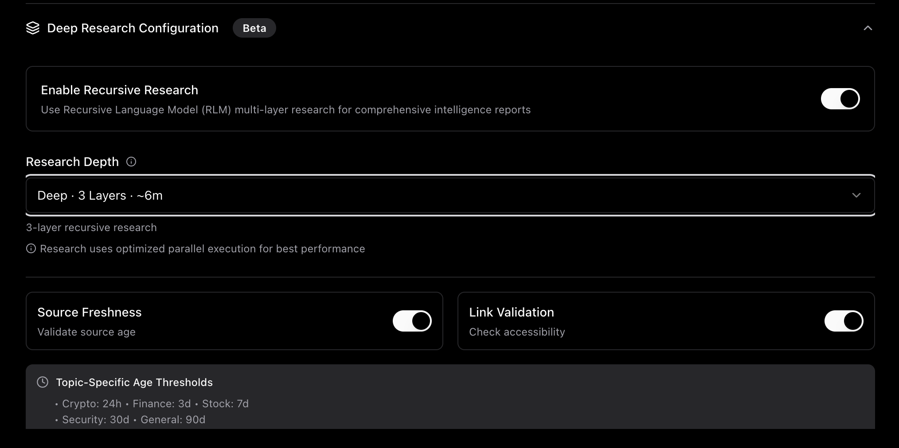
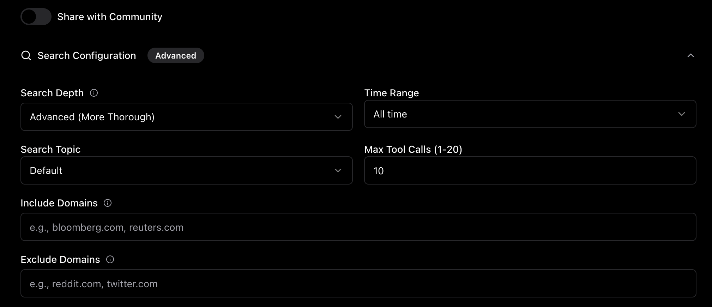
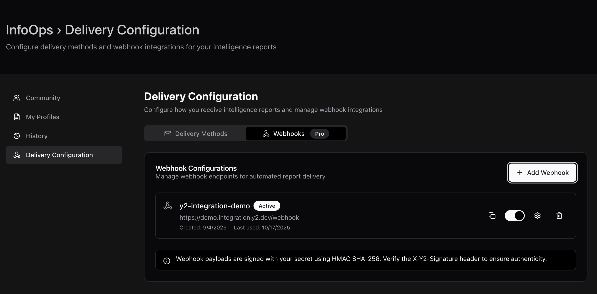
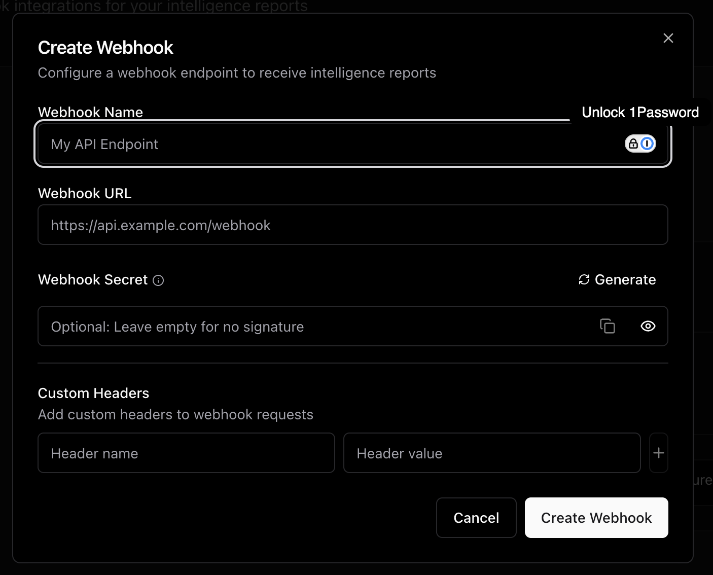
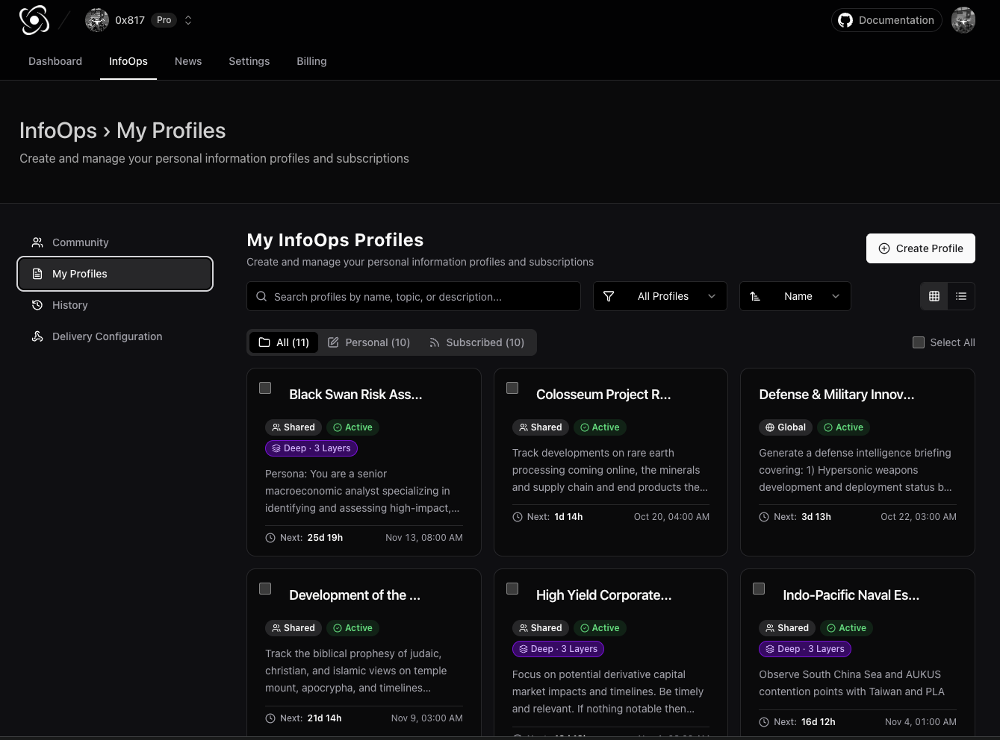
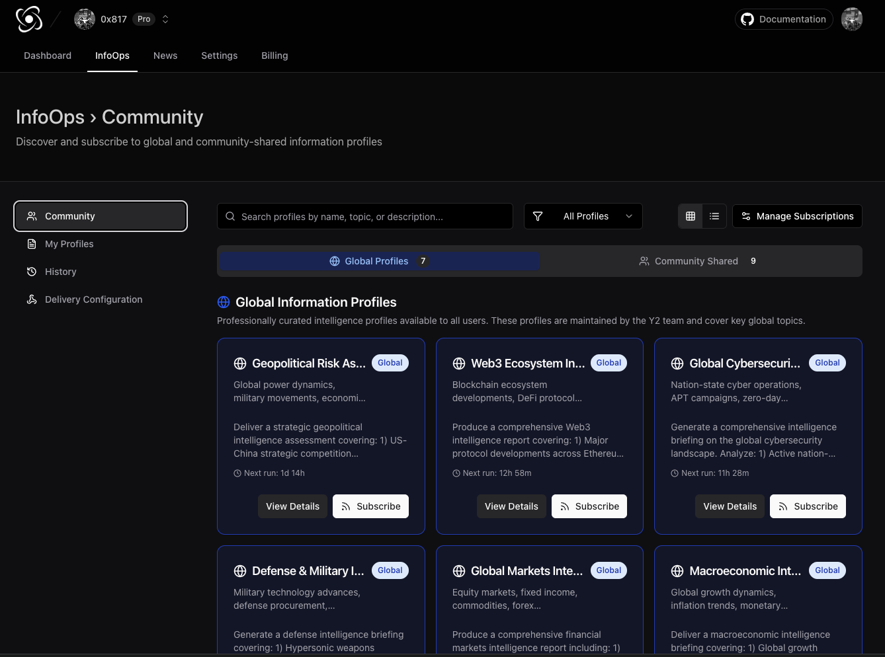

# Information Profiles

### What is a Profile?

A **profile** is a configured intelligence report that runs on a schedule. Think of it as a personalized news analyst that researches your chosen topics and delivers insights automatically.

Each profile defines:

* **What** to research (topic and focus areas)
* **How** to research (recursion depth, search strategy)
* **When** to deliver (schedule and timing)
* **Where** to send (email, SMS, webhook)

### Creating Your First Profile

#### Step 1: Navigate to InfoOps Tab

From your dashboard, access the InfoOps section.

#### Step 2: Choose Your Topic

Click "Create New Profile" and define your research topic:

**Topic Best Practices:**

* Be specific but not overly narrow
* Include context (industry, timeframe, geographic focus)
* Avoid yes/no questions

**Good Examples:**

* "Bitcoin price analysis and market sentiment"
* "Cybersecurity threats to healthcare institutions"
* "Apple Inc stock performance and analyst ratings"
* "Quantum computing research breakthroughs"

**Poor Examples:**

* "News" (too broad)
* "Is Bitcoin going up?" (yes/no question)
* "Stocks" (lacks focus)

#### Step 3: Configure Basic Settings

**Profile Name**

* Descriptive label for your reports (e.g., "Daily Bitcoin Brief")
* Used in email subject lines and report headers

**Delivery Frequency**

* Daily: Every day at specified time
* Weekly: Specific day of week (e.g., Monday 9 AM)
* Biweekly: Every two weeks
* Monthly: First day of month

**Delivery Time**

* Time zone defaults to your account settings
* Consider optimal reading time (e.g., 7 AM for morning briefs)

### Configuring Recursive Research

#### Step 4: Enable Recursion

<figure><figcaption></figcaption></figure>

**Toggle Recursive Research**

* OFF: Standard single-pass generation (fast, lower cost)
* ON: Multi-layer recursive research (comprehensive, higher quality)

#### Step 5: Select Research Depth

&#x20;_Screenshot placeholder: Slider or radio buttons showing depth 0-3_

**Depth 0: Quick Intelligence**

```
Time: 30 seconds
Sources: 3-5
Layers: 1 (broad scan only)

Best for:
✓ Daily price updates
✓ Quick news summaries
✓ Fact-checking
✓ Low-cost monitoring
```

**Depth 1: Standard Research (Recommended)**

```
Time: 90 seconds
Sources: 12-20
Layers: 2 (broad scan + focused deep dives)

Best for:
✓ Weekly intelligence reports
✓ Competitive analysis
✓ Industry trends
✓ Investment research
```

**Depth 2: Deep Investigation**

```
Time: 4 minutes
Sources: 40-60
Layers: 3 (scan + deep dives + verification)

Best for:
✓ Strategic planning
✓ Due diligence
✓ Comprehensive assessments
✓ Academic-quality research
```

**Depth 3: Maximum Depth (Advanced)**

```
Time: 10-15 minutes
Sources: 100+
Layers: 4 (maximum recursion)

Best for:
✓ Critical decision-making
✓ Regulatory compliance research
✓ M&A due diligence
✓ Research paper support
```

### Advanced Configuration

#### Source Freshness Settings

**Enable Source Validation**

* Validates source recency and link accessibility
* Adds \~10-15 seconds to report generation
* Highly recommended for time-sensitive topics

**Topic-Specific Age Thresholds**

```
Crypto/Finance: 24 hours
  Use when: Researching volatile assets, daily market analysis

Security Threats: 30 days
  Use when: Cybersecurity intelligence, vulnerability tracking

Industry News: 90 days
  Use when: Trend analysis, strategic research

Custom: Set your own threshold
  Use when: Specialized topics with unique recency requirements
```

**Staleness Detection**

* Scans content for outdated year references (2020, 2021, etc.)
* Detects phrases like "archived" or "deprecated"
* Flags sources that may be outdated despite recent publication

#### Link Health Checking

**Enable Link Validation**

* Verifies all sources are accessible (HTTP 200-299)
* Runs asynchronously (doesn't delay report delivery)
* Results stored in report metadata

**Web Archive Fallback**

* Automatically fetches Wayback Machine snapshots for dead links
* Preserves historical sources
* Metadata includes archive URL and snapshot date

#### Custom Prompts

&#x20;_Screenshot placeholder: Text area for custom system prompts_

Add specific instructions to tailor report focus:

**Example Custom Prompts:**

```
Focus on technical analysis and chart patterns,
not just price movements.
```

```
Prioritize primary sources (official announcements,
SEC filings) over media coverage.
```

```
Include both bullish and bearish perspectives
for balanced analysis.
```

```
Emphasize quantitative data (statistics, percentages)
over qualitative commentary.
```

### Search Configuration

#### Domain Filtering

<figure><figcaption></figcaption></figure>

**Include Domains (Whitelist)**

```
Example for crypto research:
- coinmarketcap.com
- coingecko.com
- coindesk.com
- cointelegraph.com

Result: Only search these trusted sources
```

**Exclude Domains (Blacklist)**

```
Example for removing low-quality content:
- reddit.com
- twitter.com
- medium.com/@randomuser

Result: Never include these sources
```

#### Time Range Filtering

&#x20;_Screenshot placeholder: Dropdown for time range selection_

**Day (Last 24 hours)**

* Best for: Breaking news, daily market updates
* Example: "Bitcoin price today"

**Week (Last 7 days)**

* Best for: Recent developments, weekly summaries
* Example: "Cybersecurity incidents this week"

**Month (Last 30 days)**

* Best for: Trend analysis, monthly reports
* Example: "Tech industry layoffs January 2025"

**Year (Last 12 months)**

* Best for: Annual reviews, historical analysis
* Example: "AI research breakthroughs 2024"

**All Time**

* Best for: Evergreen topics, comprehensive background
* Example: "History of quantum computing development"

### Delivery Configuration

#### Email Delivery

&#x20;_Screenshot placeholder: Email configuration form_

**Format Options:**

* Full HTML (recommended): Complete report with styling
* Plain Text: Simple text-only version
* BLUF Only: Bottom Line Up Front executive summary

**Email Preferences:**

* Include sources section: Yes/No
* Include metadata (costs, sources count): Yes/No
* Attach PDF version: Yes/No (Pro feature)

#### SMS Delivery

&#x20;_Screenshot placeholder: Phone number input and SMS options_

**SMS Summary**

* Automatically generated 140-character summary
* Includes link to full web version
* Best for: Time-sensitive alerts, mobile-first consumption

**Example SMS:**

```
BTC $47.2K (+2.1%). Institutional buying
continues. ETF inflows $230M.
```

#### Webhook Integration

<figure><figcaption></figcaption></figure>

<figure><figcaption></figcaption></figure>

**Webhook URL**

* POST endpoint to receive report JSON
* Includes full content, metadata, and sources
* HMAC signature for verification

**Payload Format:**

```json
{
  "type": "y2_intelligence_report",
  "version": "2.0",
  "deliveryId": "k1a2b3c4d5e6f7g8h9i0j1k2",
  "timestamp": 1704067200000,

  "profile": {
    "id": "j57abc123...",
    "name": "Daily Bitcoin Brief",
    "topic": "Bitcoin market analysis and sentiment"
  },

  "report": {
    "id": "k2b3c4d5e6f7g8h9i0j1k2l3",
    "generatedAt": 1704067200000,
    "model": "z-ai/glm-4.5"
  },

  "content": {
    "html": "<h1>Bitcoin Market Analysis</h1><h2>Bottom Line Up Front</h2><p>Bitcoin maintains...</p>",
    "text": "Bitcoin Market Analysis\n\nBottom Line Up Front\nBitcoin maintains $47K support...",
    "smsSummary": "BTC $47.2K (+2.1%). Institutional buying continues. ETF inflows $230M.",
    "sources": [
      "https://coinmarketcap.com/currencies/bitcoin/",
      "https://www.coindesk.com/markets/2025/01/18/bitcoin-etf-inflows/",
      ...
    ]
  },

  "metadata": {
    "tokenUsage": {
      "inputTokens": 2143,
      "outputTokens": 3821,
      "totalTokens": 5964
    },
    "cost": 0.15,
    "sourcesCount": 23,
    "generationTimeMs": 112000,
    "recursionMetadata": {
      "depth": 1,
      "strategy": "hybrid",
      "layersProcessed": 2,
      "subtopicsGenerated": [
        "Bitcoin institutional investment Q1 2025",
        "Bitcoin ETF regulatory developments",
        "Bitcoin technical support levels"
      ]
    },
    "freshnessMetadata": {
      "averageAgeMs": 716800000,
      "freshnessScore": 0.89,
      "staleSourcesCount": 2
    }
  }
}
```

**Authentication:**

* HMAC-SHA256 signature in `X-Y2-Signature` header
* Idempotency key in `X-Y2-Idempotency-Key` header
* Automatic retries with exponential backoff

### Profile Management

#### Viewing Active Profiles

<figure><figcaption></figcaption></figure>

**Profile Dashboard shows:**

* Name and topic
* Next scheduled delivery
* Last delivery timestamp
* Subscriber count
* Status (active/paused)
* Quick actions (edit, pause, delete)

#### Editing Profiles

Click "Edit" on any profile to modify:

* Topic and custom prompts
* Recursion settings
* Delivery schedule
* Subscription settings

**Note:** Changes take effect on the next scheduled report. They do not affect reports already in progress.

#### Pausing Profiles

Temporarily disable a profile without deleting:

* Preserves all configuration
* Stops scheduled deliveries
* Retains subscriber list
* Can be resumed anytime

**Use cases:**

* Vacation/time off
* Budget management
* Testing alternative configurations

#### Deleting Profiles

Permanently removes profile and all associated data:

* Cancels all subscriptions
* Deletes delivery history
* Removes scheduled workflows
* **Cannot be undone**

### Subscription Sharing

#### Community Profiles

**Share Your Profile**

* Make profile discoverable to other Y2 users
* Others can subscribe to your research
* You control topic, schedule, and configuration
* Subscribers receive same reports as you

**Benefits:**

* Build audience for your research
* Share costs across subscribers
* Establish expertise in your domain
* Community feedback and engagement

#### Global Profiles

<figure><figcaption></figcaption></figure>

**Subscribe to Pre-configured Profiles:**

* Curated by Y2 team
* Optimized configurations
* Popular topics and industries
* Free for all Pro users

**Examples:**

* "Daily Crypto Market Brief" (depth 1, daily 7 AM)
* "Weekly Cybersecurity Intelligence" (depth 2, Monday 9 AM)
* "S\&P 500 Weekly Analysis" (depth 1, Friday 4 PM)
* "AI Research Breakthroughs" (depth 2, biweekly)


### Best Practices

#### Optimizing for Quality

**Use Depth 1 as Default**

* Best balance of quality and cost
* 12-20 sources provide comprehensive coverage
* 90-second generation time is acceptable for most schedules

**Enable Source Validation**

* Freshness scoring ensures relevance
* Link checking prevents dead sources
* Minimal performance impact (10-15 seconds)

**Customize Your Prompts**

* Guide research focus without over-constraining
* Use clear, specific language
* Test and iterate based on results

### Troubleshooting

#### Reports Are Too Generic

**Solution:**

* Increase recursion depth (0 → 1 or 1 → 2)
* Add custom prompts with specific focus areas
* Use domain filtering to prioritize quality sources
* Narrow topic to be more specific

#### Reports Are Outdated

**Solution:**

* Enable source freshness validation
* Reduce maximum source age threshold
* Use "day" or "week" time range
* Check that topic has recent news coverage

#### Sources Are Broken

**Solution:**

* Enable link health checking
* Enable Web Archive fallback
* Exclude domains with frequent downtime
* Report persistent issues to Y2 support


